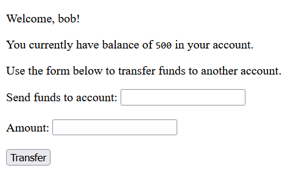
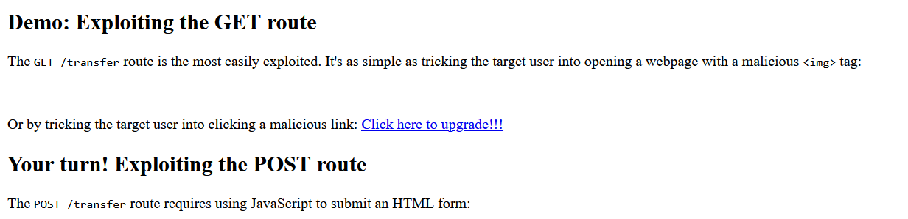
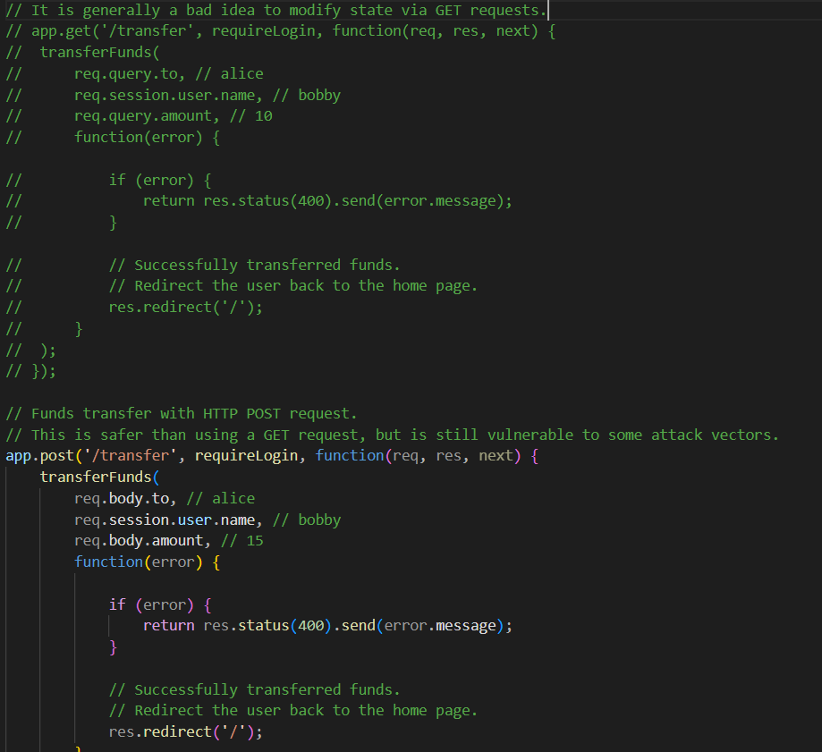
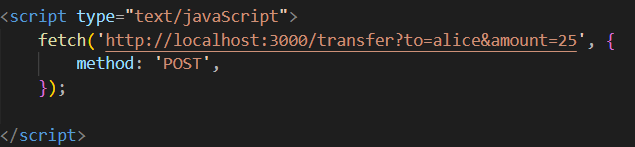
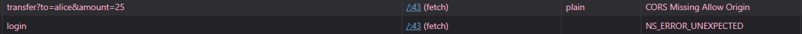
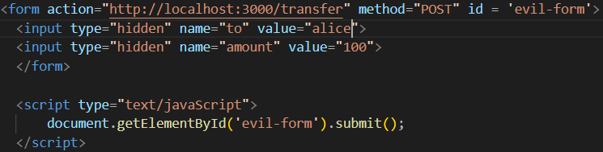

# Exploring Cross Site Request Forgery

## /transfer endpoints with GET request

The lab experiment I am going through today contains two sites, one malicious and one normal site meant to emulate some type of banking app. Immediately, there is a link on the decoy site that uses the /transfer endpoint to send money to another user.

- http://localhost:3000/transfer?to=alice&amount=25

~~This vulnerability is so obvious I didn't really think it was a problem at large, but I guess it does make sense if you don't validate who is sending the request using sessions.~~
EDIT: I didn't read that the URL only contains the receiver, and not the sender. My initial reaction was based on that I thought it was possible to do a get request to force a transfer without even being logged in.

I decided to log out of the "bob" account and begin using incognito tabs (which only saves session cookies for the current tab) as the website provided didn't have a logout option. This allows me to log in as alice or bob at once.

I tried clicking the link again as alice, and this time money did not transfer between accounts. The website does do validation of the session user, so this vulnerability was more concerning than my initial reaction.

## GET vs POST

I never really knew the difference between GET and POST. My limited knowledge was that it was just a paradigm that people followed, read/write in POST and read-only in GET. Apparently, POST requests can only be done through async Javascript requests or form submissions.

This gives some level of protection, but it isn't that much safer. Instead of clicking the link, the malicious site can just load a script and make a POST request to the victim site anyways.

Same Origin Policy is meant to protect the user, but I also didn't understand how that couldn't be forged. I will look at that after trying to experiment with AJAX Post requests though.

## Attacking /transfer POST endpoint

I decided to comment out the GET endpoint for /transfer for simplicity sake. Then I created a script that send a POST to /transfer on page load.

However, this code failed. I got an error from CORS (Cross-Origin Resource Sharing) being not enabled. This is because Same Origin Policy is enabled. However, when asking ChatGPT about the errors I got from the failed attack, it mentioned that SOP only protects against **Javascript** forged POST requests. It even showed me a better vector of attack through auto submitting forms. ChatGPT is supposed to not give suggestions on attacks but I was not going to complain.

So I changed the malicious code to use auto-submitting form:

## How to defend against HTML form with javascript submission on load?

There are two strong methods to defend against CSRF:

* Same Site Cookies

* CSRF tokens

## Same Site Cookies

CSRF is inherently a vulnerability within how the internet handles state. It is a consequence of the requirement that browsers must maintain cookies and provide them when requested, unless otherwise told. Without login cookies, APIs like payment sites would not be able to work. And so, it is not the responsibility of the browser but the server to define when cookies should be accessible through other sites or not.

Thus, a common fix is to set cookies to only be sent on same site requests. Now, no other site can force you to transfer your balance with a simple request. In order for balance transfer to occur, you must go onto the banking site and transfer your money there.

This changes the way authorization and payments work on the internet. If you wanted to buy from a theoretical merchant, they will create some type of transaction that needs to be fulfilled. In order to fulfill it, they redirect you to a payment service's website where you will authorize the payment. The original merchant will never see the request which approves the payment, but they will be notified by the payment service the transaction has completed.

## CSRF tokens

CSRF tokens are slightly different. They are tokens that are embedded into the form when the site is sent. These tokens ensure the form originates on the site which will be receiving the POST request.

My initial thought was, why can't a forger just make a request to the endpoint which distributes the form, but this action would be protected by Same Origin Policy. Websites can make requests to other sites, but they **cannot** read the response unless permitted by CORS.