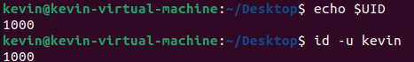
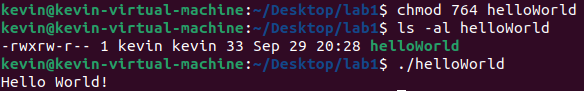
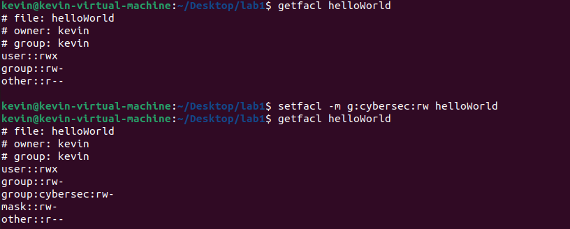

# User Commands

## useradd vs adduser

adduser is a wrapper around the command useradd. It uses a builder pattern to create a command to enter into useradd.

## switch user

Switching users from root to sally did not require a password. The command prompt switched from the # symbol back to the $ symbol.
Trying to create more users as sally fails, as only root has permission to create users.

## exit command

Using the exit command returns to the parent shell. Once you are on the Ubuntu user, using exit again closes the terminal window.

## userid

we can get the userid in two ways:
* id -u &lt;user&gt;
* echo $UID

The second command only works to show the userid associated with the current shell.
The first command will also print the groups they are a part of if the -u flag is omitted.

# Group Commands

## group command

Using the group command with a username lists all the groups a user is in. Using id will list the groups and their ids.
* id &lt;user&gt;
* group &lt;user&gt;

The Ubuntu user is in these groups by default:
- cdrom : Gives priviliges to use the cd/dvd I/O channel
- sudo : Gives priviliges to use sudo, defined by sudoers file in Ubuntu
- dip : Gives priviliges to use dial-up connection
- plugdev : Permission to use removable I/O channels like usbs, floppy disks etc
- lpadmin : Permission to use printers
- lxd : Permission to use containers and modify privilages of containers.
- sambashare : Samba shared folders
&lt;user&gt;, cdrom, sudo, dip, plugdev, lpadmin, lxd, sambashare

* sudo usermod -aG sudo username

I gave &lt;newuser&gt; sudo permissions, and switched to a shell with the &lt;newuser&gt; login. Creating a new user with sudo works.
Trying to create one without sudo obviously doesn't work as only root can make new users.

* sudo groupadd cybersec

&lt;newuser&gt; is now in three groups,
- &lt;newuser&gt;
- sudo
- cybersec

# Permission and Access Control Lists

Creating a fresh directory will result in the permissions of:

- rwxrwxr-x

I then created a script called helloWorld. I had to change permissions to enable execution using chmod.

I used ACL lists to add the cybersec group which contains &lt;newuser&gt; to the permissions list.

