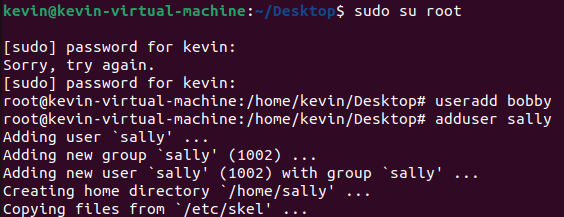

# Environment Variables

## setters and getters

The following commands are used to view, set, and unset environment variables:
- printenv : prints current environment variables
- env : can print current variables, or run a command in a new environment (sets and unsets variables in the new environment)
- export : sets an environment variable
- unset : removes the value of an environment variable

## switch user

Switching users from root to sally did not require a password. The command prompt switched from the # symbol back to the $ symbol.
Trying to create more users as sally fails, as only root has permission to create users.

## exit command

Using the exit command returns to the parent shell. Once you are on the Ubuntu user, using exit again closes the terminal window.

## userid