# Environment Variables

## modifying and accessing environment variables

The following commands are used to view, set, and unset environment variables:
- printenv : prints current environment variables
- env : can print current variables, or run a command in a new environment (sets and unsets variables in the new environment)
- export : sets an environment variable
- unset : removes the value of an environment variable

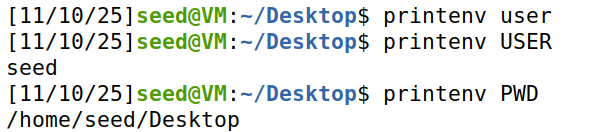

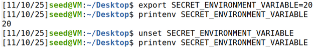

## using curl

Curl can be used to transfer files from the host machine to a virtual machine. I used python's built in httpserver to host a folder, then used curl requests to grab all the files.

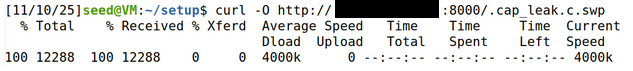

## fork()

In this section, we will show that child processes inherit the environment variables of their parent.

We use the following program which forks itself, and will print either the child or parent's environment variables.

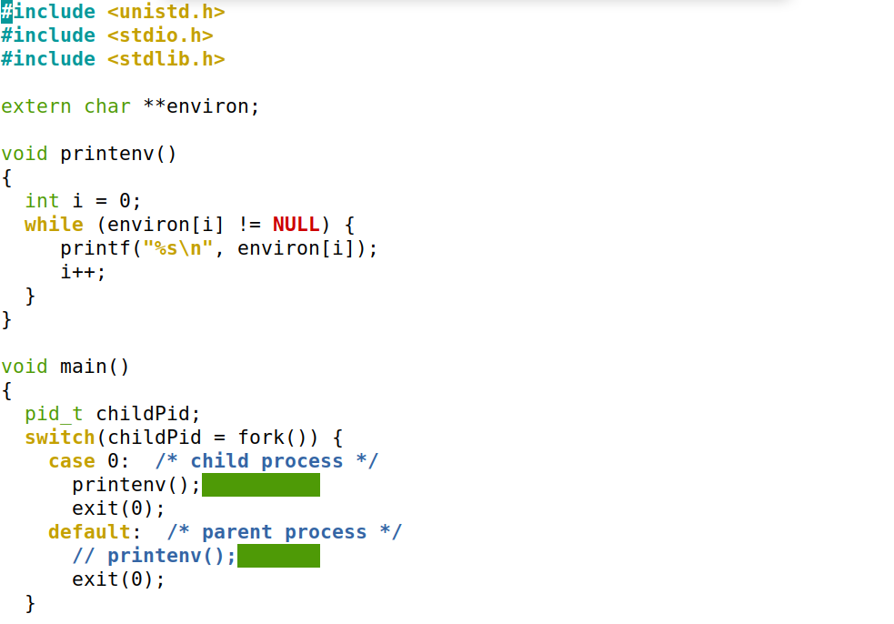

Instead of creating a command argument that decides which process prints its variables, I just created two seperate files for simplicity's sake.

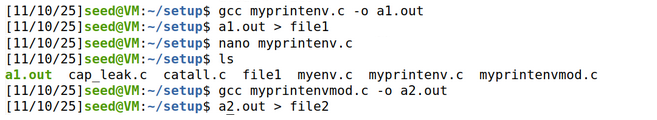

I used diff after redirecting the output for both executables into seperate files. The only difference was the file name because I ran two seperate executables.

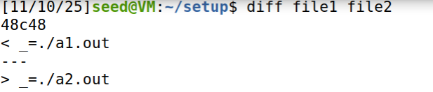

## execve()

Execve does not create a new process when executing a command. It will instead overwrite all the data of the current process. execve has the following function signature,
where argv refers to the command arguments to the new executable and envp refers to the environment variables to the environment of the new execution.

```c
int execve(const char *pathname, char *const argv[], char *const envp[]);
```

We will prove that envp determines what environment variables are set/unset in the execution environment.
First we use this snippet that calls env, which by default just prints the environment variables.

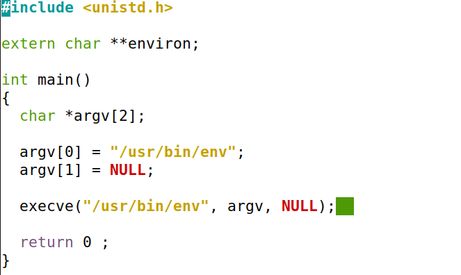

Passing in NULL should print nothing (as no environment variables are passed).

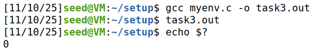

Passing in environ should print all the environment variables of the current shell.

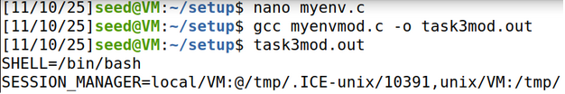

## system()

system uses execve to run a new shell and passes the program as an argument to the shell. System also passes environ by default.

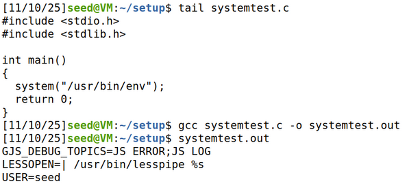

The above screenshot proves this true, as execve env without passing environ prints nothing.

## setUID programs

setUID programs allow users to run programs that have escalated privilages. Linux programs inherit their parents UID, so system and execve are potential vectors of attack if we can cause them to open malicious programs.
We used the following snippet to print the system environment variables after using `export` to set MYVAR, PATH, and LD_LIBRARY_PATH to 'custom'.

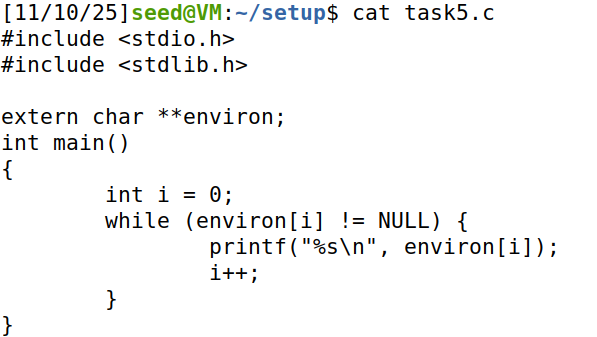

Looking through the environment variables, I found that MYVAR and PATH were modified, but LD_LIBRARY_PATH was not.
LD_LIBRARY_PATH is protected to avoid linux from linking malicious code instead of system defaults. PATH is not protected, because kernel programs don't use PATH: its purely a user-space vulnerability.
    
Modern shells have protections implemented for setUID programs: PATH can still be modified, but a poisoned PATH variable will deescalate privilage for children. and don't permit PATH modification for setUID. We use zsh to test, as it doesn't have this protection.

## Exploiting PATH with ZSH

I created a vulnerable setUID program, which calls ls using system without passing in an absolute path. The OS will attempt to resolve this using the PATH environment variable.
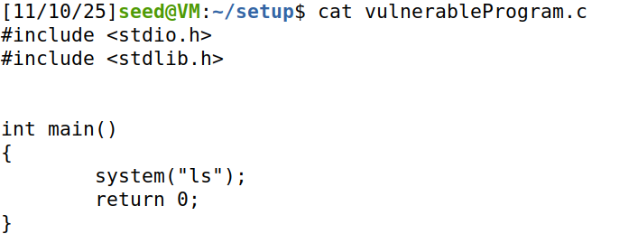
We have a "malicious" ls executable that just prints the effective user id of this fake ls.
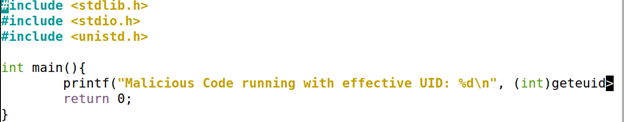

When using dash or bash, the child process does not print the UID of the parent process' owner (1000).

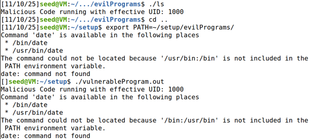

When using zsh, the child process does print the UID of the parent process' owner (0).

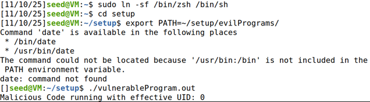

## Exploiting LD_PRELOAD

The goal of this section is to attempt to use environment variables like LD_PRELOAD to inject malicious DLLs. We designed the two snippets below to demonstrate.

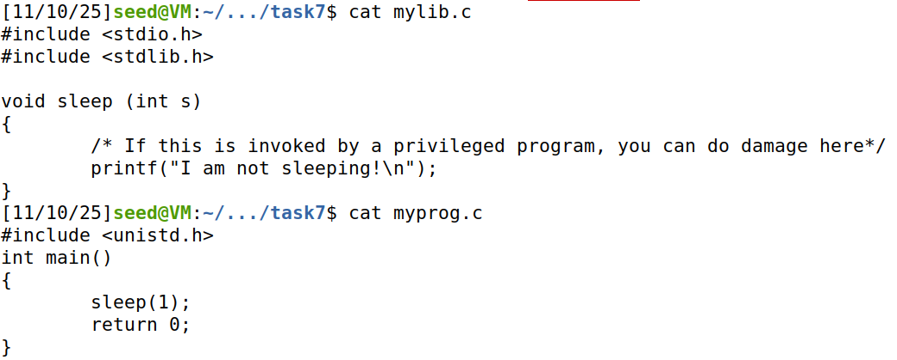

We compile mylib.c using this command: gcc -fPIC -g -c mylib.c
- -fPIC causes position independent code which uses lookup tables instead of the base address of the program (which is different for every time its linked)
- -c compiles but doesn't link the file

Then we create the shared library .so file: gcc -shared -o libmylib.so.1.0.1 mylib.o -lc
- -shared produces the .so file
- -o <filename> gives the output file's name
- <object file> instead of <source file>

After that, we set the LD_PRELOAD path to our shared library.
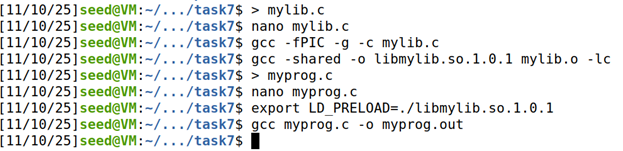

We now try multiple different permission levels and setUID owners to experiment and see what happens.
* regular file settings: malicious DLL loaded successfully
* change to setUID program: DLL isn't loaded successfully

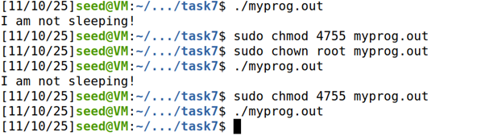

I tried to set LD_PRELOAD from root in several ways. I didn't want to open a root shell. None worked.

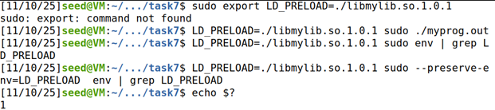

I caved.
* root running root setUID program: DLL isn't loaded successfully

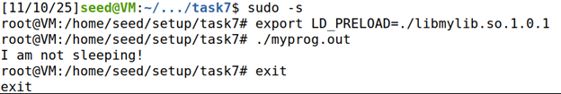

This behavior is the result of the OS protecting privilaged executions. If a user runs a setUID program, the OS will sanitize certain environment variables like LD_PRELOAD.
Since this is OS behavior, changing to ZSH doesn't open up any potential vulnerabilities.

## system() vs execve()

This section of the lab explains why system is more dangerous to use than execve. The goal is to exploit a system vulnerability in the following setUID program:

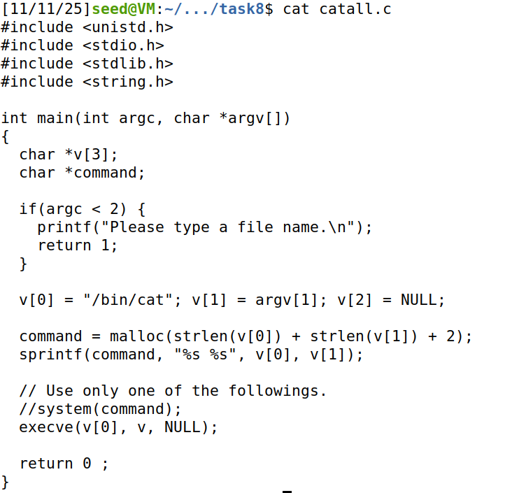

My initial instinct was to try exploiting using PATH. However, exploiting PATH isn't an option because '/bin/cat' is an absolute path. If the string inside system() was 'cat' we could use the PATH exploit using ZSH.

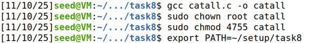

I did more research on how system actually works and learned what I had previously stated in this document:
system actually calls ```c execve("/bin/sh", (char*[]){"sh", "-c", "/bin/cat", NULL}, environ); ``` - meaning the argument to /bin/cat is an argument to /bin/sh.
This allows us to use an operator like || to run our own command if /bin/cat fails.

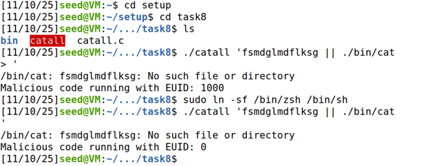

In the above, the shell tries to execute /bin/cat on a gibberish file name, which fails and then executes ./bin/cat (malicious).

When we switch to using execve and recompile, `|| ./bin/cat` is interpreted as part of the filename passed to /bin/cat. The exploit fails.

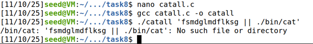

## capability leaking

If you open a file descriptor, then drop privilages in a setUID program, and create a child process, the child process will still have access to this file descriptor.

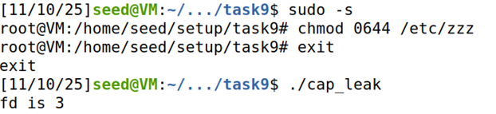
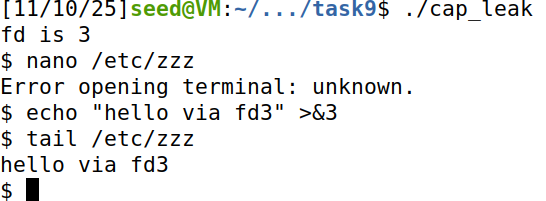